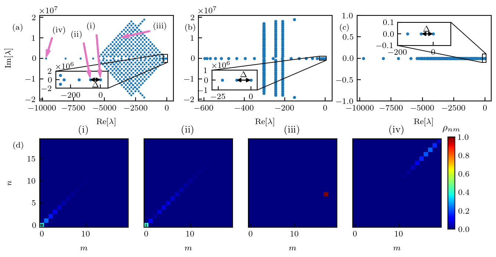

<!-- toc -->

<!-- more -->

结合近几年的经验，把`matplotlib`作图常用的脚本集合在此。这包含了之前一些关于`matplotlib`作图的博文。

# 作图风格

```python
from matplotlib import rc
def prettify_plot():
    """
    change the plot matplotlibrc file

    To use it, please run it before plotting.

    https://matplotlib.org/stable/tutorials/introductory/customizing.html#customizing-with-matplotlibrc-files
    """
    rc('text', usetex=True)
    rc('font', family='serif', serif='Computer Modern Roman', size=8)
    # rc('legend', fontsize=10)
    # rc('mathtext', fontset='cm')
    rc('xtick', direction='in')
    rc('ytick', direction='in')
```
用于调整作图的字体，风格。

# 作图尺寸，布局

```python
import matplotlib.pyplot as plt
fig = plt.figure(figsize=(3.375, 3.5))# 单栏图宽度固定3.375， 双栏图宽度固定 6.75

gs = fig.add_gridspec(nrows=2, ncols=2,
                      left=.08, bottom=.1, right=.99, top=.94,
                      wspace=1, hspace=1,
                      width_ratios=[1, 2],
                      height_ratios=[1, 0.1])
ax_a = fig.add_subplot(gs[0, 0])
ax_b = fig.add_subplot(gs[0, 1])
ax_c = fig.add_subplot(gs[1, :])
```

# 彩图及colorbar
```python
gs = fig.add_gridspec(nrows=2, ncols=2,
                      left=.08, bottom=.1, right=.99, top=.94,
                      wspace=1, hspace=1,
                      width_ratios=[1, 2],
                      height_ratios=[1, 0.1])
ax_a = fig.add_subplot(gs[0, 0])
ax_b = fig.add_subplot(gs[0, 1])
ax_c = fig.add_subplot(gs[1, :])
ima = ax_a.imshow(np.random.randn(20, 20))
fig.colorbar(ima, cax=ax_c, orientation='horizontal')
```
## 自定义color map
```python
import numpy as np
from matplotlib.colors import ListedColormap
import matplotlib.pyplot as plt
import matplotlib as mpl


def newcmap(old):
    old_map = mpl.colormaps[old]
    cut1 = old_map(np.linspace(0, 0.5, 50))
    cut2 = old_map(np.linspace(0.5, 1, 500))
#     cut3 = old_map(np.linspace(0.6, 1, 10))
    cutall = np.concatenate([cut1, cut2])
    return ListedColormap(cutall)


print(newcmap('jet'))
plt.imshow(np.random.randn(100, 100), cmap=newcmap('jet'))
plt.colorbar()
plt.savefig('newcmap.png', transparent=True)
```


[newcmap.py](2023-10-12-coding-matplotlib/newcmap.py)

# 双重坐标轴

```python
import numpy as np
import matplotlib.pyplot as plt
fig = plt.figure()
ax00 = fig.add_subplot(1, 2, 1)
ax00twin = ax00.twiny()
ax01 = fig.add_subplot(1, 2, 2)

x = np.linspace(0, 6, 100)
xtwin = np.linspace(0, 60, 100)
ax00.plot(x, np.sin(x), 'b-')
# ax00twin.plot(xtwin, np.cos(0.1*xtwin), 'r--')
ax00twin.set_xticks([0, 100, 200])
ax00.set_xlim(0, 6)
ax00twin.set_xlim(0, 200)

ax01.plot(x, np.cos(x))
ax01.secondary_xaxis(location='top', functions=(lambda x: 2*x, lambda x: 2*x))
fig.savefig('double_ax.png', transparent=True)
```


[double_ax.py](2023-10-12-coding-matplotlib/double_ax.py)

# 示例 Phys. Rev. B 108, 054313 (2023) fig1

```python
import matplotlib.pyplot as plt
from matplotlib import rc
import numpy as np
import json
import os
from types import SimpleNamespace


def get_file_name(path):
    fn = os.path.basename(path)
    fn, _ = os.path.splitext(fn)
    return fn


def prettify_plot():
    """
    change the plot matplotlibrc file

    To use it, please run it before plotting.

    https://matplotlib.org/stable/tutorials/introductory/customizing.html#customizing-with-matplotlibrc-files
    """
    rc('text', usetex=True)
    rc('font', family='serif', serif='Computer Modern Roman', size=8)
    # rc('legend', fontsize=10)
    # rc('mathtext', fontset='cm')
    rc('xtick', direction='in')
    rc('ytick', direction='in')


class FigureData:
    """
    A dict which figure data save in.
    For example:
        save:
            x1 = [1, 2, 3]
            y1 = [1, 2, 3]
            x2 = [2, 3, 4]
            y2 = [2, 3, 4]
            fd = FigureData()
            fd.add_data('x1', x1)
            fd.add_data('y1', y1)
            fd.add_data('x2', x2)
            fd.add_data('y2', y2)
            fd.save_data('mydata')
        load:
            fd = FigureData()
            fd.load_data('mydata')
            x1 = fd.d.x1
            y1 = fd.d.y1
            x2 = fd.d.x2
            y2 = fd.d.y2
    """
    def __init__(self):
        self.data = {}

    def add_data(self, name, data):
        self.data[name] = data

    def save_data(self, file_name):
        with open(file_name + '.json', 'w') as f:
            json.dump(self.data, f)

    def load_data(self, file_name):
        with open(file_name + '.json', 'r') as f:
            self.data = json.load(f)
        self.d = SimpleNamespace(**self.data)


arrowprops = {"color": 'tab:pink',
              "shrink": 0.05,
              "width": 1,
              "headwidth": 4,
              "headlength": 7}
gap_arrowprops = {"color": 'black',
                  "arrowstyle": '<|-|>',
                  'shrinkA': 0,
                  'shrinkB': 0}

fd = FigureData()
fd.load_data(get_file_name(__file__)[:-4])

prettify_plot()


fig = plt.figure(figsize=(6.75, 3.5))

gs = fig.add_gridspec(nrows=100, ncols=100,
                      left=.08, bottom=.1, right=.99, top=.94,
                      wspace=1, hspace=1)

ax_a = fig.add_subplot(gs[0:40, 0:30])
ax_a_ins = ax_a.inset_axes([.12, .15, .39, .2])
ax_b = fig.add_subplot(gs[0:40, 35:65])
ax_b_ins = ax_b.inset_axes([.1, .13, .34, .23])
ax_c = fig.add_subplot(gs[0:40, 70:])
ax_c_ins = ax_c.inset_axes([.3, .65, .4, .27])
ax_d = fig.add_subplot(gs[55:, 0:20])
ax_e = fig.add_subplot(gs[55:, 23:43])
ax_f = fig.add_subplot(gs[55:, 46:66])
ax_g = fig.add_subplot(gs[55:, 69:89])
ax_cbar = fig.add_subplot(gs[56:-1, 90:92])

ax_a.plot(fd.d.on_hop_val_real, fd.d.on_hop_val_imag,
          marker='o', ms=2, lw=0, mec='none')
ax_a.set_ylabel(r'Im$[\lambda]$')
ax_a.set_xlabel(r'Re$[\lambda]$')
ax_a.xaxis.set_label_coords(.5, -.2)
ax_a.yaxis.set_label_coords(-.2, .5)
ax_a.text(-.2, .83, '(a)', transform=ax_a.transAxes)
vec_i = [-1, -2, 100, 0]
vmax = 1
vmin = 0
ax_a.annotate('(iii)', [fd.d.on_hop_val_real[vec_i[2]],
                        fd.d.on_hop_val_imag[vec_i[2]]],
              [.85, .85], arrowprops=arrowprops, textcoords='axes fraction')
ax_a.annotate('(iv)', [fd.d.on_hop_val_real[vec_i[3]],
                       fd.d.on_hop_val_imag[vec_i[3]]],
              [.1, .8], arrowprops=arrowprops, textcoords='axes fraction')
ax_a_ins.annotate('(i)', [fd.d.on_hop_val_real[vec_i[0]],
                          fd.d.on_hop_val_imag[vec_i[0]]],
                  [.6, 3.5], arrowprops=arrowprops,
                  textcoords='axes fraction')
ax_a_ins.annotate('(ii)', [fd.d.on_hop_val_real[vec_i[1]],
                           fd.d.on_hop_val_imag[vec_i[1]]],
                  [.3, 3], arrowprops=arrowprops,
                  textcoords='axes fraction')

ax_a_ins.plot(fd.d.on_hop_val_real, fd.d.on_hop_val_imag,
              marker='o', ms=3, lw=0, mec='none')
ax_a_ins.annotate('', [0, 0],
                  [-70, 10], arrowprops=gap_arrowprops)
ax_a_ins.text(-55, -1.8e6, r'$\Delta$')

ax_a_ins.set_xlim(-300, 50)
ax_a_ins.set_ylim(-2e6, 2e6)
_, connector_lines_a = ax_a.indicate_inset_zoom(ax_a_ins, edgecolor="black",
                                                alpha=1, lw=.7)
for cl in connector_lines_a:
    cl.set(lw=.7)

ax_b.plot(fd.d.on_no_hop_val_real, fd.d.on_no_hop_val_imag,
          marker='o', ms=3, lw=0, mec='none')
ax_b_ins.plot(fd.d.on_no_hop_val_real, fd.d.on_no_hop_val_imag,
              marker='o', ms=3, lw=0, mec='none')
ax_b_ins.set_xlim(-30, 5)
ax_b_ins.set_ylim(-1e6, 1e6)
ax_b_ins.annotate('', [0, 0],
                  [-11, 0], arrowprops=gap_arrowprops)
ax_b_ins.text(-8, 3e5, r'$\Delta$')

_, connector_lines_b = ax_b.indicate_inset_zoom(ax_b_ins, edgecolor="black",
                                                alpha=1, lw=.7)
for cl in connector_lines_b:
    cl.set(lw=.7)

# ax_b.set_yticks([])
ax_b.text(-.1, .83, '(b)', transform=ax_b.transAxes)
ax_b.set_xlabel(r'Re$[\lambda]$')
ax_b.xaxis.set_label_coords(.5, -.2)

ax_c.plot(fd.d.no_on_hop_val_real, fd.d.no_on_hop_val_imag,
          marker='o', ms=3, lw=0, mec='none')
ax_c.set_ylim(-1, 1)
ax_c.text(-.13, .83, '(c)', transform=ax_c.transAxes)
ax_c.set_xlabel(r'Re$[\lambda]$')
ax_c.xaxis.set_label_coords(.5, -.2)
ax_c_ins.plot(fd.d.no_on_hop_val_real, fd.d.no_on_hop_val_imag,
              marker='o', ms=3, lw=0, mec='none')
ax_c_ins.set_xlim(-200, 100)
ax_c_ins.set_ylim(-.1, .1)
ax_c_ins.annotate('', [0, 0],
                  [-65, 0], arrowprops=gap_arrowprops)
ax_c_ins.text(-55, .02, r'$\Delta$')

_, connector_lines_c = ax_c.indicate_inset_zoom(ax_c_ins, edgecolor="black",
                                                alpha=1, lw=.7)
for cl in connector_lines_c:
    cl.set(lw=.7)

# ax_e.plot([5], [15],
#           'gx', ms=2)
# ax_d.plot([5], [15],
#           'rx', ms=2)
# ax_f.plot([5], [15],
#           'bx', ms=2)
# ax_g.plot([5], [15],
#           color='orange', marker='x', ms=2)

im_d = ax_d.imshow(fd.d.on_hop_vecs_abs[vec_i[0]],
                   cmap='jet', origin='lower', vmax=vmax, vmin=vmin)
ax_d.text(-.3, .9, '(d)', transform=ax_d.transAxes)
ax_d.set_xlabel(r'$m$')
ax_d.set_ylabel(r'$n$')
ax_d.xaxis.set_label_coords(.5, -.2)
ax_d.yaxis.set_label_coords(-.3, .5)
ax_d.set_title('(i)')

ax_e.imshow(fd.d.on_hop_vecs_abs[vec_i[1]],
            cmap='jet', origin='lower', vmax=vmax, vmin=vmin)
ax_e.set_yticks([])
ax_e.set_xlabel(r'$m$')
ax_e.xaxis.set_label_coords(.5, -.2)
ax_e.set_title('(ii)')

ax_f.imshow(fd.d.on_hop_vecs_abs[vec_i[2]],
            cmap='jet', origin='lower', vmax=vmax, vmin=vmin)
ax_f.set_yticks([])
ax_f.set_xlabel(r'$m$')
ax_f.xaxis.set_label_coords(.5, -.2)
ax_f.set_title('(iii)')

ax_g.imshow(fd.d.on_hop_vecs_abs[vec_i[3]],
            cmap='jet', origin='lower', vmax=vmax, vmin=vmin)
ax_g.set_yticks([])
ax_g.set_xlabel(r'$m$')
ax_g.xaxis.set_label_coords(.5, -.2)
ax_g.set_title('(iv)')

ax_cbar.tick_params(size=0)
ax_cbar.set_title(r'$\rho_{nm}$')
fig.colorbar(im_d, cax=ax_cbar)
fig.savefig(get_file_name(__file__)[:-4] + '.pdf', dpi=200)
fig.savefig(get_file_name(__file__)[:-4] + '.png', dpi=200, transparent=True)
```

画图数据：[fig2.json](2023-10-12-coding-matplotlib/fig2/fig2.json)



# 参考资料

1. https://matplotlib.org/stable/

